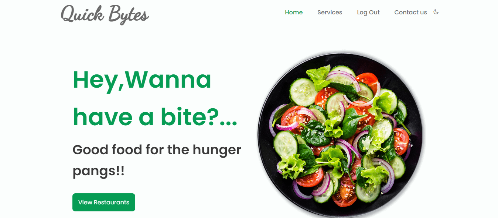
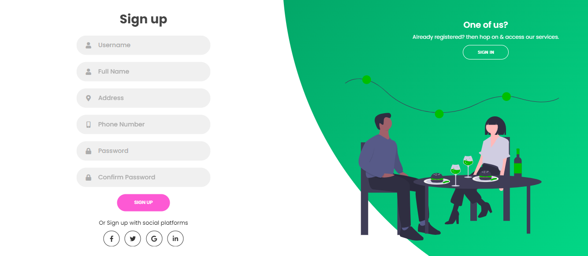
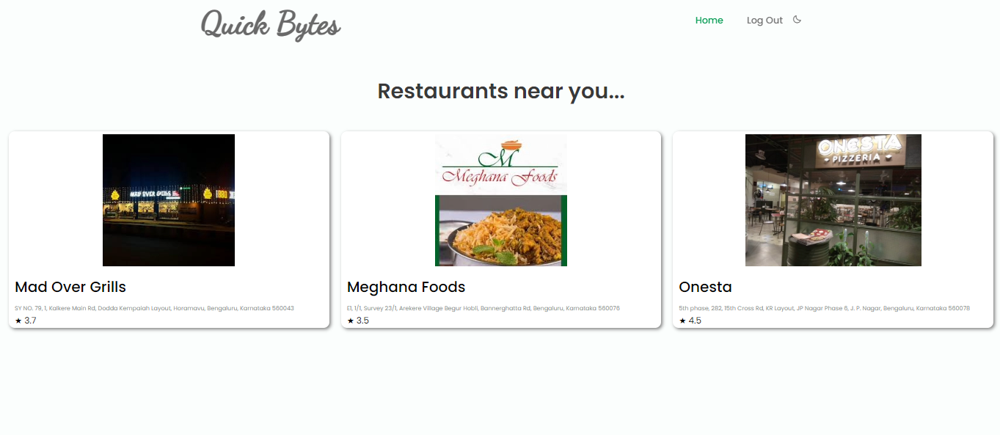
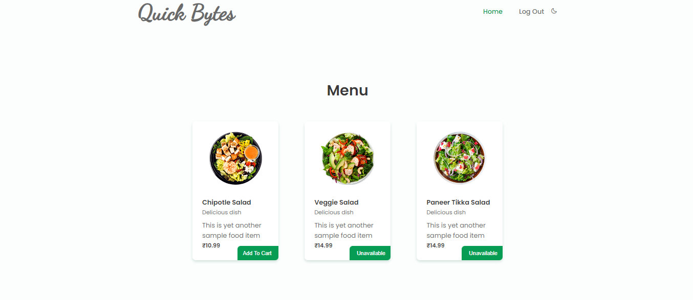
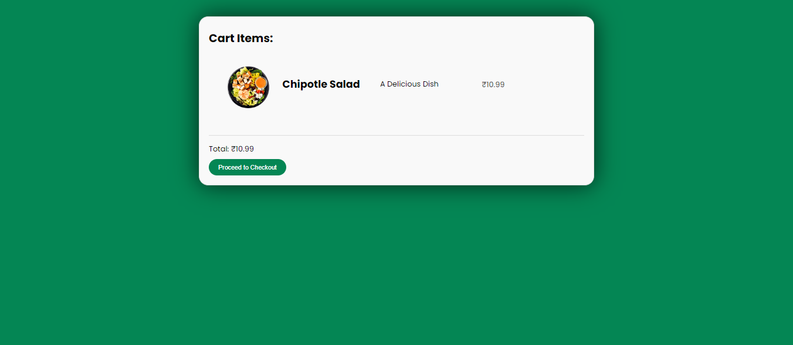
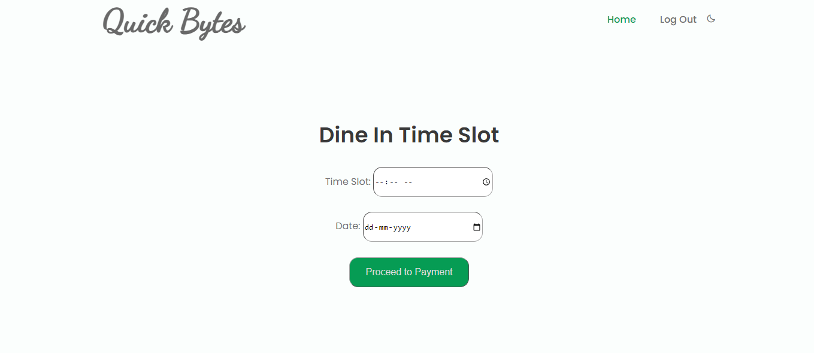
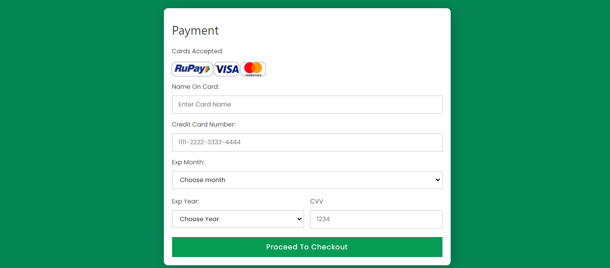
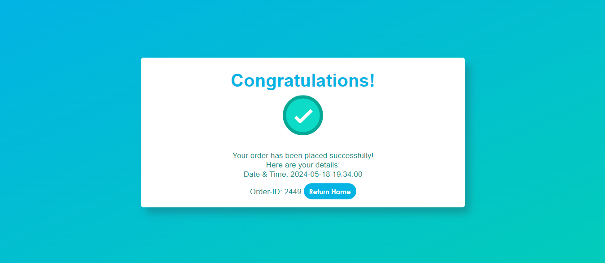
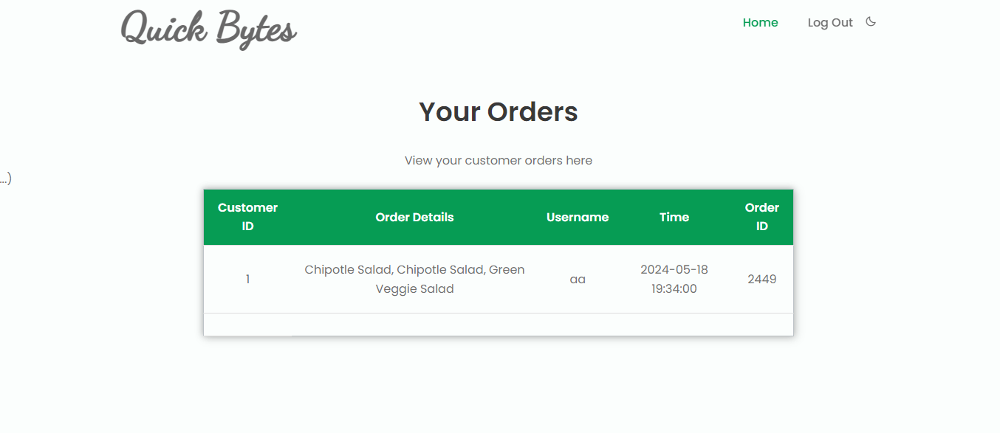

# Quick Bytes
# Restaurant Management System

Quick Bytes is a web-based restaurant management system built using Flask, catering to both customers and hoteliers. It allows customers to view available hotels, menus, place orders securely, and complete payment transactions. Hoteliers can manage customer details, orders, verify OTPs, and serve food to authenticated customers.

## Table of Contents

- [Introduction](#introduction)
- [Tech Stack](#tech-stack)
- [Key Features](#key-features)
- [Installation](#installation)


## Introduction

Quick Bytes is a Flask-based restaurant management system designed to streamline the process of ordering and serving food. It offers a convenient platform for both customers and hoteliers to interact and manage their tasks efficiently.

## Tech Stack

- HTML<a href="https://www.w3.org/html/" target="_blank" rel="noreferrer">  </a> 
- CSS<a href="https://www.w3schools.com/css/" target="_blank" rel="noreferrer">  </a>
- JavaScript
- Python <a href="https://www.python.org" target="_blank" rel="noreferrer">  </a>
- Flask<a href="https://flask.palletsprojects.com/" target="_blank" rel="noreferrer">  </a>
- SQLite <a href="https://www.sqlite.org/" target="_blank" rel="noreferrer">  </a>


## Customer Interface

- View available hotels and menus.
- Select items and place orders securely.
- Complete payment transactions.
- Authenticate OTP at the hotel to receive food.

## Hotelier Interface

- Tabular view of customer details, order details, Order ID, and time (ETA of customer).
- Access customer receipts and contact details.
- Verify OTP to ensure order authenticity.
- Serve food to authenticated customers.

## Home page

## Registration page

## Sign Up page

## Restaurants page 

## Menu Page 

## Carts Page 

## Time-Slot Page 

## Payment Gateway 

## Order-Confirmation Page

## Hotelier Page



## Challenges Faced
- Integrating databases and backend with the UI
- Implementing SMTP application
    

## Installation

First, clone this repository and create a virtual environment using:
```
python -m venv venv
```
Activate the virtual environment:
```
./venv/Scripts/activate
```
Install the required packages using:
```
pip install -r requirements.txt
```
Install the SQL packages using:
```
pip install -U Flask-SQLAlchemy
```

Run the command in terminal
```
python run.py
```
Copy `http://127.0.0.1:5000/` and paste it in the address bar of a browser.


## Further Improvements
- Improving database integration
- Building better authorization service

## Team
## [S Sujeeth Shingade](https://github.com/sujeethshingade)
## [Mayank Chaturvedi](https://github.com/mayankch283)
## [Sujay J Ram](https://github.com/SujJR)
## [Ankit A K](https://github.com/Ankman07)


